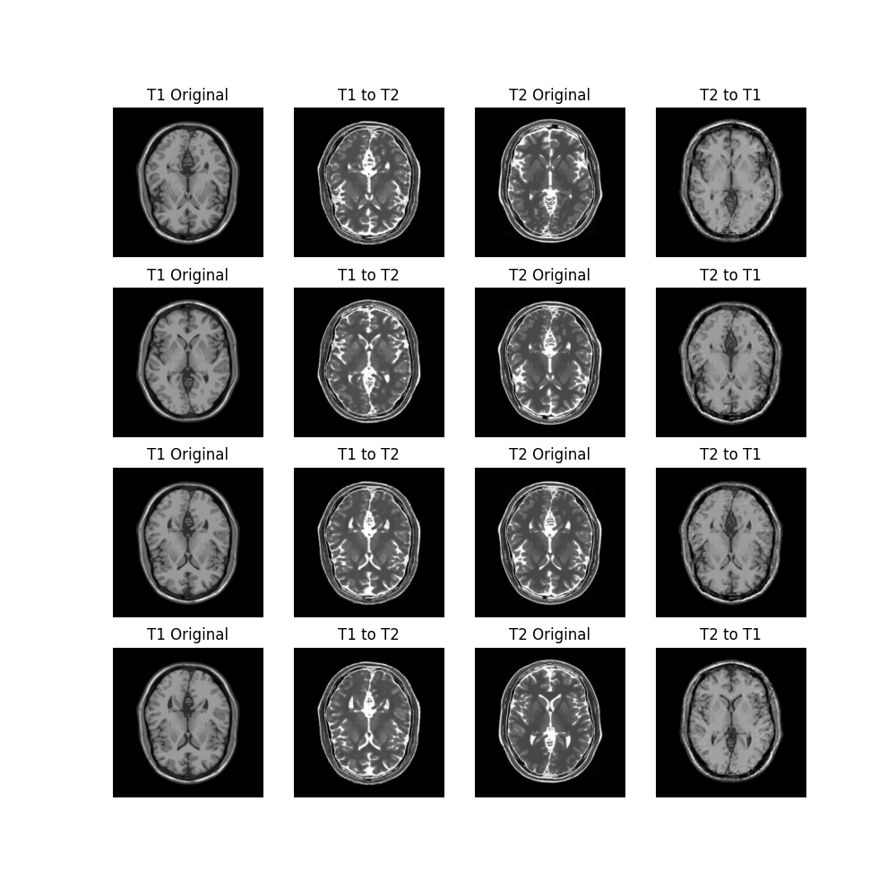

# MRIGan

## Dataset

Dataset is placed in the `data` folder. `T1` and `T2` dataset placed under respective folders. All path are defined under utils module in `paths.py` file.

## Model

Model related code is placed under `model` folder. `mri_gan.py` contains the intialization, training and ploting code. `generator.py` and `discriminator.py` contains the generator and discriminator model respectively. `conv_block.py` contains the convolution block used in both generator and discriminator.

## Architecture
Downsample block used skip connection from input to output. Upsample block used skip connection from input to output and from output to input. The skip connection is used to preserve the spatial information. The architecture is shown below.

Generator Architecture is U-Net like architecture. And discriminator is PatchGAN architecture.

## Training

Training is done using `mri_gan.py` file. The training is done in two steps. First step is to train the generator and discriminator separately. Second step is to train the generator and discriminator together. The training is done for 260 epochs. The training is done using Adam optimizer with learning rate 0.0002 and beta1 0.5. The training is done on A6000 GPU.

### Results
GIF of the results is shown below.
[GIF](https://storage.googleapis.com/deeplearning-archive/MRIGan/cyclegan_360.gif)

Final epoch results are shown below.

Model archive is below.
[Model Archive](https://storage.googleapis.com/deeplearning-archive/MRIGan/models.zip)
